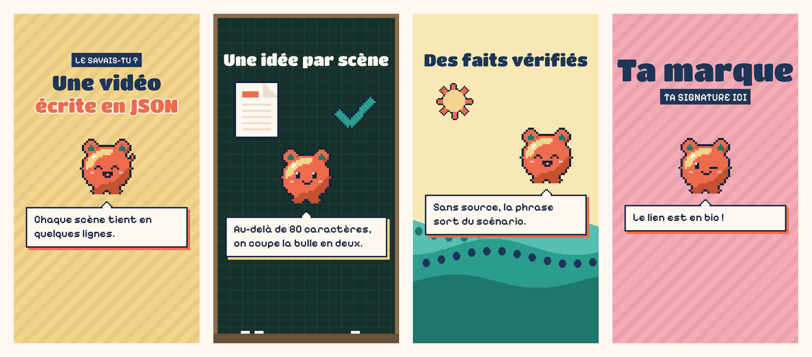

# vitrine-kit

Un kit d'agents pour construire, référencer et faire vivre un site e-commerce ou vitrine avec Claude. On l'installe, on répond à quelques questions, et 21 skills travaillent à partir du même contexte de marque.

> *A plugin marketplace for Claude: 21 skills that share one brand-context file to build, rank and run an e-commerce or brochure site. Skills are written in French; outputs follow the language set in the brand context.*



## L'idée

La plupart des collections de prompts recopient le contexte de la marque dans chaque fichier. Dès que l'offre change, tout est faux.

Ici, un seul fichier décrit la marque (`brand/brand-context.md`), et chaque skill le lit au moment de s'exécuter. Les skills ne contiennent que de la méthode. Changer de projet, c'est changer un fichier.

```
                 ┌────────────────────────────┐
   setup ──────▶ │  brand/brand-context.md    │ ◀── le site (source de vérité)
  (interview)    │  brand/kit.config.json     │
                 └─────────────┬──────────────┘
                               │ lu à chaque exécution
     ┌──────────┬──────────┬───┴──────┬──────────┬──────────┐
     ▼          ▼          ▼          ▼          ▼          ▼
  Construire  Être trouvé  Publier   Convertir  Diffuser   Mesurer
  site-clone  seo-audit    seo-writer   cro     social-*   ads-audit
  copywriting seo-schema   blog-pipeline email  mascot-    seo-data
  shopify-    seo-pages    directory-   -flows  reels
  liquid      seo-geo      pages                ad-creative
```

## Installation

Dans Claude Code :

```bash
claude plugin marketplace add leocoffao-ctrl/agencyecommercepro
claude plugin install vk-core@vitrine-kit      # obligatoire
claude plugin install vk-seo@vitrine-kit       # puis ceux dont tu as besoin
```

Ensuite, dans une session ouverte à la racine de ton projet :

```
/vk-core:setup     interview et création du contexte de marque
/vk-core:start     où en est le projet, quelle est la prochaine étape
```

Autres surfaces (claude.ai, application de bureau) et installation locale : [docs/installation.md](docs/installation.md).

## Ce qu'il y a dedans

| Plugin | Skills | À quoi ça sert |
|---|---|---|
| `vk-core` | `setup`, `brand-context`, `start` | Le contexte de marque et le routeur |
| `vk-seo` | `seo-audit`, `seo-geo`, `seo-schema`, `seo-data`, `seo-pages`, `seo-writer` | Audit, visibilité dans les IA, données structurées, pages qui vendent, rédaction |
| `vk-content` | `blog-pipeline`, `directory-pages` | Blog automatisé de bout en bout, pages d'annuaire avec score sur 100 |
| `vk-marketing` | `copywriting`, `cro`, `email-flows`, `ad-creative` | Textes de pages, conversion, emails, publicités |
| `vk-ads` | `ads-audit` | Audit publicitaire en lecture seule |
| `vk-shopify` | `shopify-liquid` | Code de thème Shopify en production |
| `vk-design` | `site-clone` | Reprendre la structure d'un site de référence, jamais son contenu |
| `vk-social` | `social-plan`, `social-publish` | Audit hebdomadaire, plan, légendes, publication programmée |
| `vk-reels` | `mascot-reels` | Vidéos verticales en pixel art rendues par du code |

Deux contextes remplis servent de démonstration, pour deux marques fictives : une boutique Shopify ([Atelier Verveine](examples/atelier-verveine/brand/brand-context.md)) et un site vitrine WordPress ([Studio Paliss](examples/studio-paliss/brand/brand-context.md)).

## Ce qui en fait un système, pas une liste de prompts

**Un contexte partagé.** Offre, prix, affirmations autorisées, ton, charte, stack : écrits une fois. Un fait manquant reste marqué `A_COMPLETER` au lieu d'être deviné, et le site l'emporte sur le fichier en cas d'écart.

**Des pipelines qui tournent seuls.** `blog-pipeline` choisit les sujets dans un backlog, fait la recherche, rédige, contrôle, crée les articles dans le CMS avec une date future et livre un dossier par lot. Sa mémoire tient dans des fichiers `MANIFEST.json`, pas dans la conversation. `social-plan` audite les statistiques chaque semaine et écrit les consignes que la tâche de publication suit.

**Des contrôles qui bloquent.** Six scripts Python renvoient un code d'erreur tant que le livrable n'est pas conforme : liens internes cassés, FAQ visible différente de la FAQ du schema, prix en dur, JSON-LD en double avec le thème, mots bannis par la marque, tics d'écriture d'IA, hashtags au-delà du plafond de la plateforme.

**Des garde-fous écrits.**
- Dépense d'API : annonce du coût avant chaque série d'appels, seuil au-delà duquel on demande, plafond par exécution planifiée.
- Comptes publicitaires : lecture seule, même si le connecteur permet d'écrire.
- Thème en production : nouveaux fichiers à côté des anciens, jamais de publication ni de suppression sans demande.
- Publication : toujours programmée, jamais immédiate ; validation explicite avant tout envoi.
- Faits : chaque chiffre a sa source et sa date de relevé, sinon il sort.

**Un mode dégradé partout.** Chaque skill se termine par un tableau « avec / sans » connecteur. Sans DataForSEO, sans Zernio ou sans accès au CMS, le skill fait ce qui reste possible et dit ce que le résultat y perd.

**Une boucle de retour.** Les statistiques des posts alimentent le plan de la semaine suivante ; l'audit SEO alimente le backlog d'articles.

Détail des choix : [docs/architecture.md](docs/architecture.md).

## Les scripts

| Script | Skill | Ce qu'il fait |
|---|---|---|
| `article_checks.py` | `seo-writer`, `blog-pipeline` | Contrôles bloquants sur un article HTML (slug, métadonnées, corps, schema, liens) |
| `build_articles.py` | `blog-pipeline` | Contrôle un lot et produit le fichier d'import (CSV Matrixify ou JSON neutre) |
| `build_fiche.py` | `directory-pages` | Génère la page d'annuaire, son JSON-LD et sa note de livraison à partir d'un JSON |
| `check_fiche.py` | `directory-pages` | Densité, maillage, attributs des liens, schema, blocs obligatoires |
| `check_anti_ia.py` | `social-publish` | Tics d'écriture d'IA en français, mots bannis de la marque |
| `check_legende.py` | `social-publish` | Ce que le fil montre avant « … plus », hashtags, liens, caractères invisibles |
| `score_accroche.py` | `social-publish` | Note et classe des accroches sur cinq critères |
| `audit.py` | `social-plan` | Classe les posts par multiple de portée, partages et enregistrements |
| `reel_engine.py` | `mascot-reels` | Rend une vidéo 1080 × 1920 avec son 8-bit à partir d'un scénario JSON |

Tout tourne avec la bibliothèque standard de Python, sauf le moteur vidéo (Pillow, numpy, ffmpeg).

```bash
python3 scripts/lint_repo.py     # manifestes, en-têtes des skills, copies synchronisées, fuites
python3 tests/run_tests.py       # exécute chaque script sur les exemples fictifs
```

## Un moteur vidéo re-thématisable

Le même scénario, rendu avec le thème d'une autre marque : seules les couleurs du fichier `themes/*.json` changent.


## D'où ça vient

Ce kit est la version générique d'un système construit et utilisé en production sur une boutique en ligne. L'étude de cas est dans [docs/etude-de-cas.md](docs/etude-de-cas.md).

Il s'appuie sur le travail d'autres personnes. Les skills SEO, publicité, marketing, Liquid, clone de site et réseaux sociaux sont des **adaptations** de projets open source sous licence MIT : traduits, restructurés, branchés sur le contexte partagé et dotés d'un mode dégradé. Le tableau complet, auteur par auteur, est dans [NOTICE.md](NOTICE.md).

Ce qui est écrit pour ce kit : le cerveau de marque et son interview, le routeur, la méthode de rédaction `seo-writer`, le pipeline de blog, les pages d'annuaire (prompt master, générateur, contrôles, feuille de style), le moteur vidéo, et tout ce qui relie les pièces entre elles : configuration, contrôles, tests.

Trois skills de design de tiers, utilisés pendant la construction, ne sont pas redistribués : [docs/dependances-design.md](docs/dependances-design.md).

## Limites connues

- Les skills sont rédigés en français. Les contrôles d'écriture (`check_anti_ia.py`, `score_accroche.py`) ne connaissent que les motifs du français.
- La création directe d'articles est décrite pour Shopify et WordPress ; ailleurs, le pipeline livre un fichier d'import.
- La publication sur les réseaux passe par l'API Zernio. Un autre service demande de réécrire quatre étapes sur dix.
- Les références reprises de projets tiers portent leur date de dernière vérification : le SEO et les règles des plateformes bougent, revérifie avant de t'en servir comme argument.
- Les scores (santé SEO, visibilité IA, fiche sur 100) sont des heuristiques de travail, pas des signaux des moteurs.

## Licence

MIT pour ce dépôt. Les parties adaptées restent soumises aux licences de leurs auteurs, reproduites dans [`licenses/`](licenses/).
